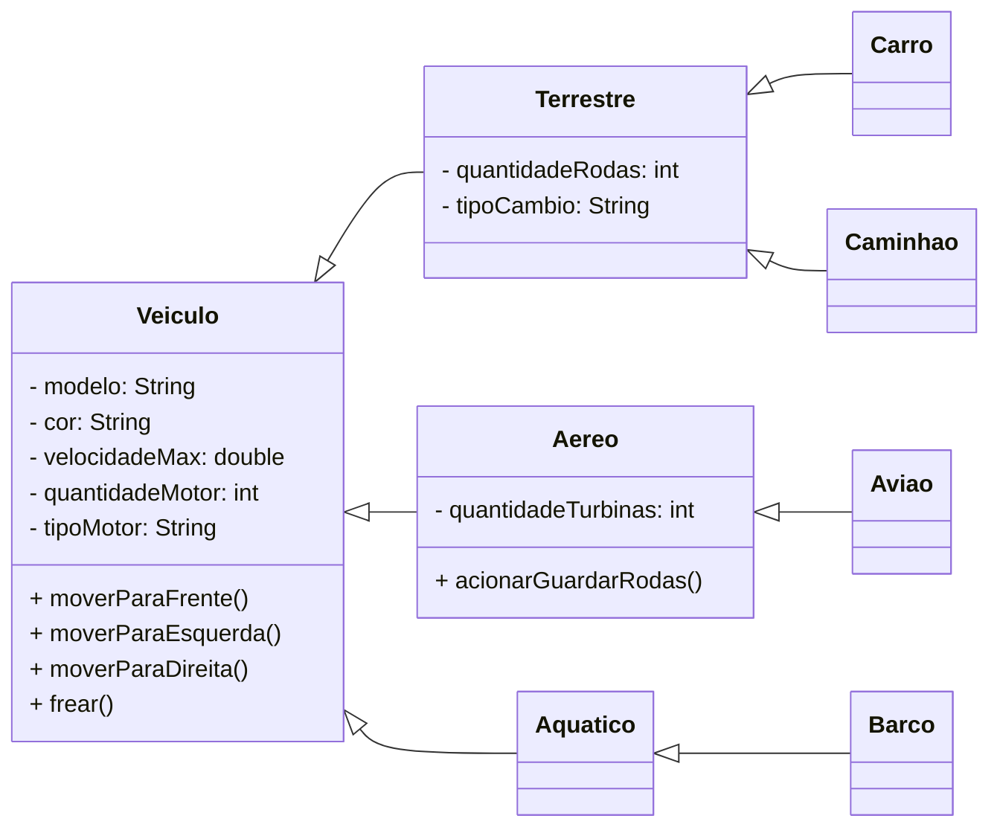

```mermaid

classDiagram
    
    direction LR
    
    class Veiculo {
        
        - modelo: String
        - cor: String
        - velocidadeMax: double
        - quantidadeMotor: int
        - tipoMotor: String
        
        + moverParaFrente()
        + moverParaEsquerda()
        + moverParaDireita()
        + frear()
    }
    
    class Terrestre {
        - quantidadeRodas: int
        - tipoCambio: String
    }
    
    class Carro {
        
    }
    
    class Caminhao {
        
    }
    
    class Aereo {
        - quantidadeTurbinas: int
        
        + acionarGuardarRodas()
        
    }
    
    class Aquatico {
        
    }
    
    class Aviao {
        
    }
    
    class Barco {
        
    }
    
    Veiculo <|-- Terrestre
    Terrestre <|-- Carro
    Terrestre <|-- Caminhao
    Veiculo <|-- Aereo
    Veiculo <|-- Aquatico
    Aquatico <|-- Barco
    Aereo <|-- Aviao
    
    


```