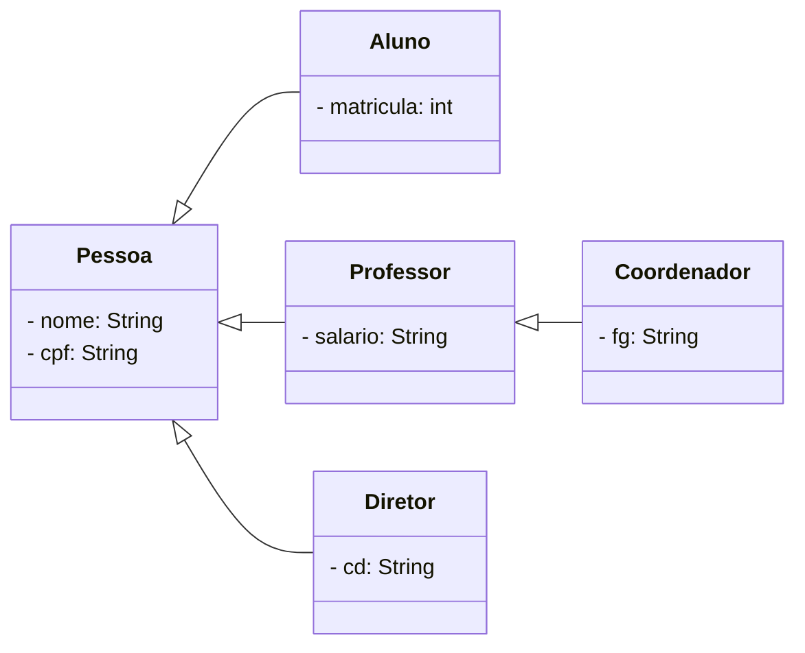

```mermaid

classDiagram
    
    direction LR
    
    class Pessoa {
        - nome: String
        - cpf: String
    }
    
    class Aluno {
        - matricula: int
    }
    
    class Professor {
        - salario: String
    }
    
    class Coordenador {
        - fg: String
    }
    
    class Diretor {
        - cd: String
    }
    
    Pessoa <|-- Aluno
    Pessoa <|-- Professor
    Pessoa <|-- Diretor
    Professor <|-- Coordenador
        


```