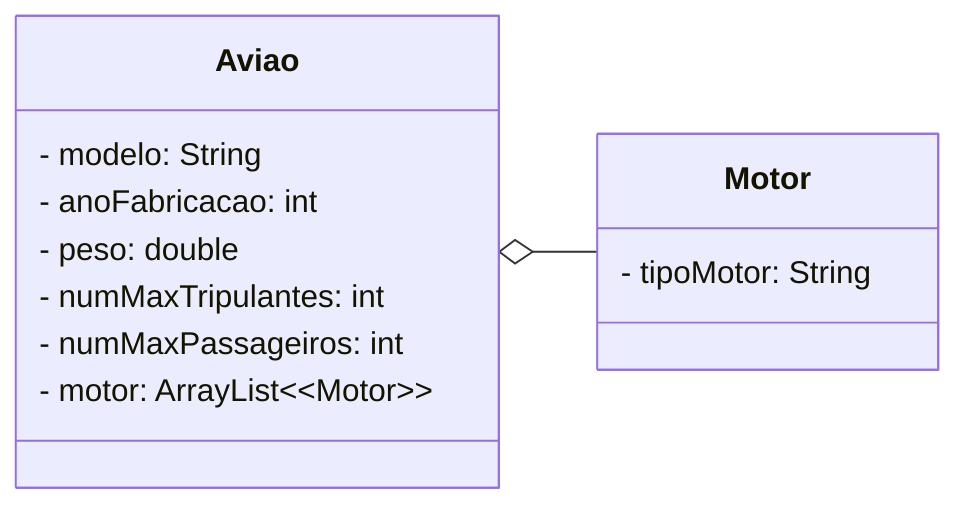

```mermaid

classDiagram
    
    direction LR
    
    class Aviao {
        
        - modelo: String
        - anoFabricacao: int
        - peso: double
        - numMaxTripulantes: int
        - numMaxPassageiros: int
        - motor: ArrayList<~Motor~>
    }
    
    class Motor {
        - tipoMotor: String
    }
    
    Aviao o-- Motor


```