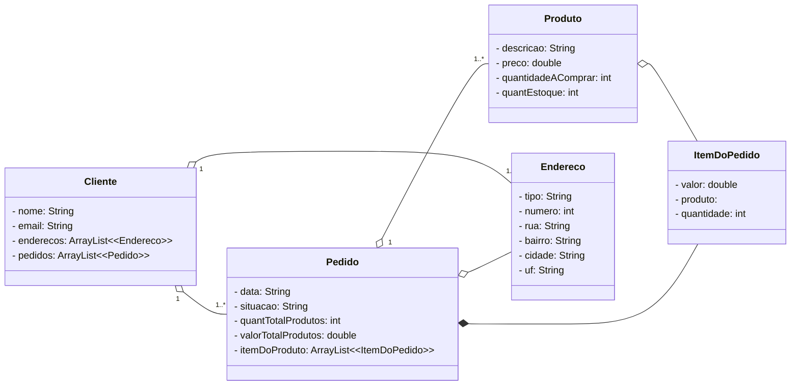

```mermaid

classDiagram
    
    direction LR
    
    class Produto {
        - descricao: String
        - preco: double
        - quantidadeAComprar: int
        - quantEstoque: int
    }
    
    class Cliente {
        - nome: String
        - email: String
        - enderecos: ArrayList<~Endereco~>
        - pedidos: ArrayList<~Pedido~>
    }
    
    class Pedido {
        - data: String
        - situacao: String
        - quantTotalProdutos: int
        - valorTotalProdutos: double
        - itemDoProduto: ArrayList<~ItemDoPedido~>
    }
    
    class ItemDoPedido {
        - valor: double
        - produto: 
        - quantidade: int
    }
    
    class Endereco {
        - tipo: String
        - numero: int
        - rua: String
        - bairro: String
        - cidade: String
        - uf: String
    }
    
    Cliente "1" o--  "1..*" Endereco
    Cliente "1" o-- "1..*" Pedido
    Pedido "1" o-- "1..*" Produto
    Pedido o-- Endereco
    Produto o-- ItemDoPedido
    Pedido *-- ItemDoPedido
    
    
```