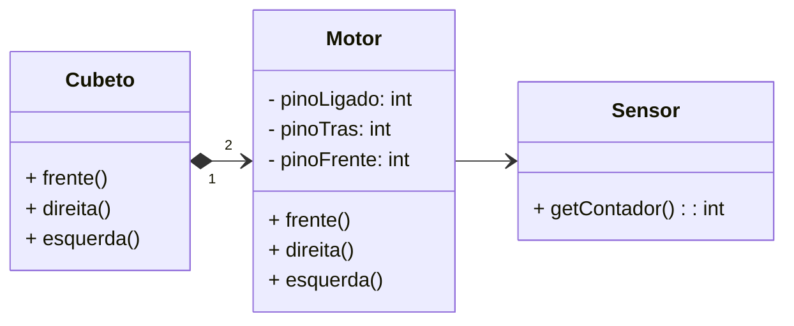

```mermaid

classDiagram
    
    direction LR
    
    class Cubeto {
        + frente()
        + direita()
        + esquerda()
    }
    
    class Motor {
        - pinoLigado: int
        - pinoTras: int
        - pinoFrente: int
        
        + frente()
        + direita()
        + esquerda()
    }
    
    class Sensor {
        + getContador(): int
    }
    
    Cubeto "1" *--> "2" Motor
    Motor --> Sensor
        

```