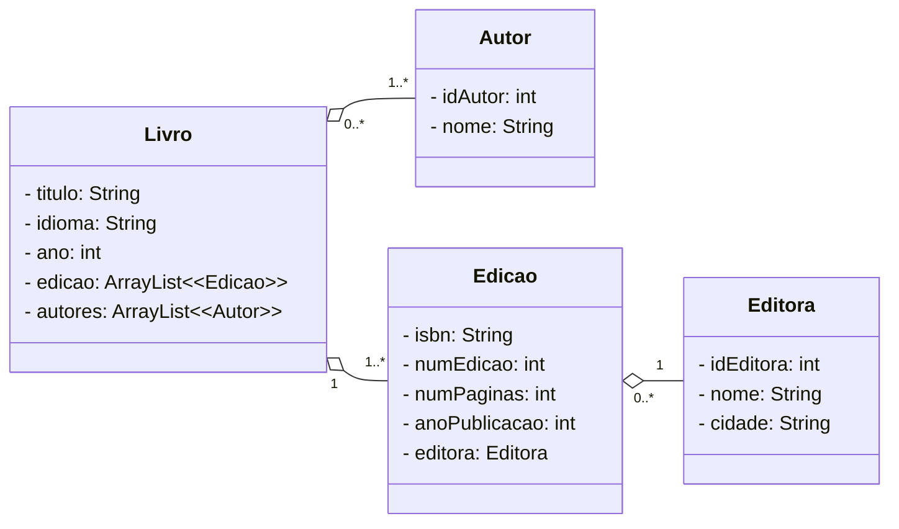

```mermaid

classDiagram
    
    direction LR
    
    class Livro {
        - titulo: String
        - idioma: String
        - ano: int
        - edicao: ArrayList<~Edicao~>
        - autores: ArrayList<~Autor~>
    }
    
    class Autor {
        - idAutor: int
        - nome: String
    }
    
    class Editora {
        - idEditora: int
        - nome: String
        - cidade: String
    }
    
    class Edicao {
        - isbn: String
        - numEdicao: int
        - numPaginas: int
        - anoPublicacao: int
        - editora: Editora
    }
    
    Livro "0..*" o-- "1..*" Autor
    Edicao "0..*" o-- "1" Editora
    Livro "1" o-- "1..*" Edicao
    
    


```